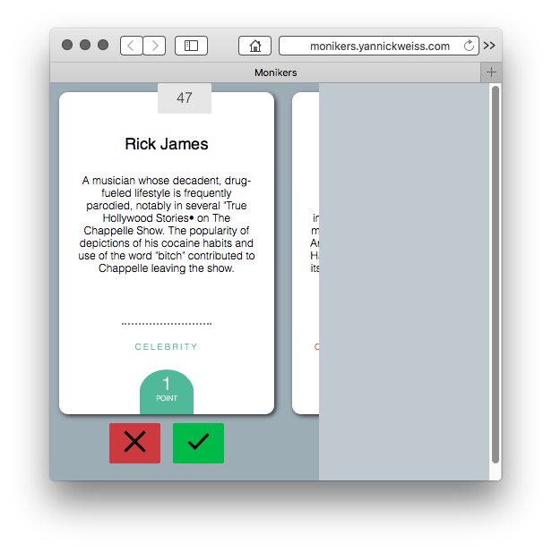

# Monikers card game
This is a prototype to find a way to make a card game in the browser that feels good. The bar is set by the game Hearthstone with its fluid drag movements and playful animations.



# babel convert js
```
babel script.js --watch --out-file script-compiled.js
```

# Decisions
* Add buttons to control the game or use swipe gestures. Swipe gestures require a small tutorial but give you more screen space.

# Todo
* let persons select 5 of 8 cards
* change viewport -> stretch app on phones, fix width on desktop
* dynamic card size, font should increase on bigger phones
* try to use ES6 and convert
* animate the game setup
* replace purecss with custom css
* prevent accidental clicks -> maybe save sate to local storage
* manifest file
* favicon, apple touch icons
* maybe use font awesome icons http://stackoverflow.com/questions/22885702/html-for-the-pause-symbol-in-a-video-control
* swipe down = score card
* when card is scored do a swipe down animation
* play sound when enemy teams turn

# optimization
* maybe reference to the all cards array instead of making a copy

# Mobile Safari View Size
Safari view is smaller than the screen, min 740px
http://stackoverflow.com/questions/24889100/ios-8-removed-minimal-ui-viewport-property-are-there-other-soft-fullscreen

# third party code
* http://t4t5.github.io/sweetalert/
* purecss.io

# scroll snap
I learned you can use nowrap to prevent line breaks. And you have to be careful of space gaps, best to use flex.
http://blog.gospodarets.com/css-scroll-snap/
